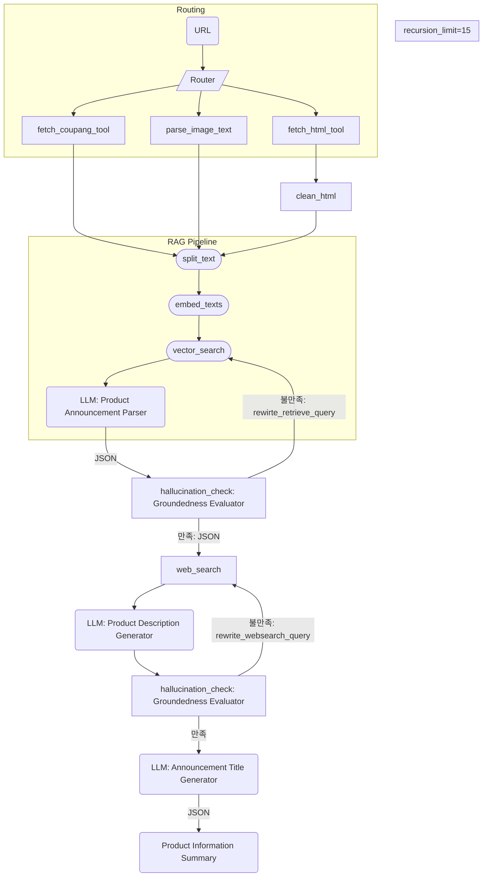

# 14-YG-AI

### 사용 방법
> 0. 우리가 준 .env 랑 api key.json을 로컬 디렉토리에 둔다

> 1. python3 -m venv .venv

> 2. source .venv/bin/activate

> 3. pip install --upgrade pip (생략 가능)

> 4. pip install -r requirements.txt

> 5. python app.py


### API 명세

- **Method:** `POST`
- **Endpoint:** `/generation/description`

### ✅ 요청 예시
```json
{
  "url": "https://myprotein/link"
}
```

### 📌 요청 파라미터

- **필수**
  - `url`: string  
- **선택**
  - (없음)

---

### ✅ 응답: 200 OK
```json
{
  "message": "상품 상세 설명이 생성되었습니다.",
  "data": {
    "product_name": "건강 햇반 3종 혼합 세트 (백미10 흑미10 발아현미10)",
    "product_lower_name": "햇반",
    "total_price": 58390,
    "count": 30,
    "summary": "햇반 컵반, 간편하고 맛있는 한 끼🍚를 찾는 당신에게 딱! 👍 오뚜기 컵밥보다 맛있다는 평가에 순한 카레맛, 
                낙지 콩나물 비빔밥 등 다양한 맛까지! 😋 햇반 솥반은 소고기우엉 영양밥으로 건강도 챙기세요! 💪 
                전자레인지 2분이면 완성되는 든든한 식사, 햇반과 함께하세요! ✨"
  }
}
```

---

### ⚠️ 응답: 400 Bad Request
```json
{
  "message": "유효하지 않은 URL 형식입니다.",
  "data": null
}
```

---

### 🔥 응답: 500 Internal Server Error
```json
{
  "message": "서버에서 오류가 발생했습니다. 잠시 후 다시 시도해주세요.",
  "data": null
}
```
<details><summary>0502 랭그래프 아키텍처</summary>


</details>

### 0513 랭그래프 아키텍처 

